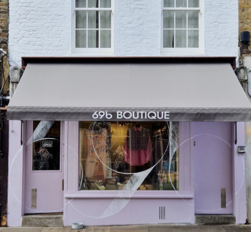

# 69bboutique Web Scraper

A Python web scraper for extracting product information from 69bboutique.com.



## Overview

This scraper navigates through the pages of 69bboutique.com to gather details about each product, including product name, price, available sizes, collection name, collection description, and fabric type.

## Features

- Scrapes product information from each page of the website.
- Converts the scraped data into a pandas DataFrame for further analysis.
- Handles multiple pages by dynamically finding the total number of pages.
- Includes error handling for network requests and data extraction.

## Setup and Usage

### Requirements
- Python 3.6 or higher
- Required Python packages listed in `requirements.txt`

### Installation

1. Clone the repository:

```sh
git clone https://github.com/erenunal-1/69bboutique_web_scraper.git
cd 69bboutique_web_scraper

2. Install the required packages:

```sh
pip install -r requirements.txt
```

## Running the Script

```sh
python 69bboutique.py
```

## Sample Output

## Sample Output

| Product Name             | Price (£) | Available Sizes   | Collection   | Collection Description                                                       | Fabric Type    |
|--------------------------|-----------|-------------------|--------------|------------------------------------------------------------------------------|----------------|
| Pink Panther Poncho      | 74.00     | None              | Rainkiss     | Rainkiss is an Amsterdam-based brand aiming to provide sustainable rainwear. | RECYCLED       |
| Classic Smiley Poncho    | 74.00     | None              | Rainkiss     | Rainkiss is an Amsterdam-based brand aiming to provide sustainable rainwear. | RECYCLED       |
| Snakes on a Poncho       | 74.00     | None              | Rainkiss     | Rainkiss is an Amsterdam-based brand aiming to provide sustainable rainwear. | RECYCLED       |
| The Clouds Rain Poncho   | 74.00     | None              | Rainkiss     | Rainkiss is an Amsterdam-based brand aiming to provide sustainable rainwear. | RECYCLED       |
| Parakeet Vest            | 35.00     | [XS, S, M, L, XL] | 69b Boutique | None                                                                         | ORGANIC COTTON |

## License
This project is licensed under the [MIT License](https://github.com/erenunal-1/69bboutique_web_scraper/blob/main/LICENSE) - see the LICENSE file for details.
